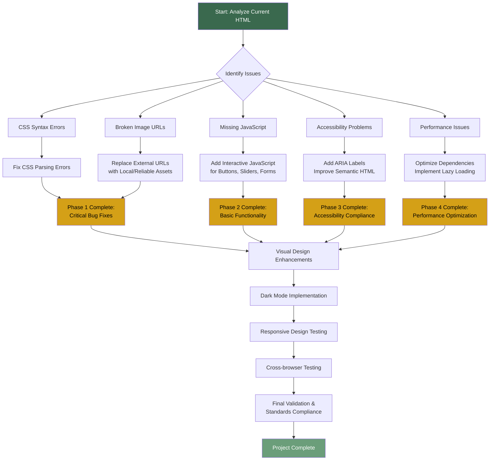

# Tea Insight Dashboard Debugging Workflow

## Phase Details

### Phase 1: Critical Bug Fixes (Immediate)
- Fix CSS syntax errors preventing proper rendering
- Replace broken external image URLs
- Ensure basic page loads without errors

### Phase 2: Core Functionality
- Add JavaScript for interactive elements
- Implement form validation
- Create basic dashboard interactions

### Phase 3: Accessibility
- Add ARIA attributes for screen readers
- Improve keyboard navigation
- Ensure color contrast compliance

### Phase 4: Performance
- Optimize external resource loading
- Implement lazy loading for images
- Reduce render-blocking resources

### Phase 5: User Experience
- Add dark mode toggle
- Enhance visual design with subtle animations
- Improve responsive behavior

### Phase 6: Testing & Validation
- Cross-browser compatibility testing
- Mobile responsiveness testing
- Performance benchmarking
- Accessibility audit

## Expected Outcomes

After completing this workflow, the Tea Insight Dashboard will:

1. **Load correctly** without CSS parsing errors
2. **Display all images** without broken links
3. **Have fully functional** interactive elements
4. **Meet accessibility standards** for all users
5. **Load quickly** with optimized performance
6. **Work seamlessly** across all modern browsers
7. **Provide enhanced UX** with dark mode and responsive design
8. **Maintain visual appeal** with polished UI elements